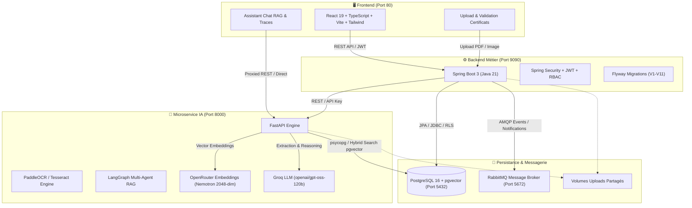

# 🎓 CertificationHub — Plateforme Intelligente de Gestion des Certifications IT

[](docker-compose.yml)
[](backend-spring/)
[](backend-ai/)
[](frontend/)
[](https://github.com/pgvector/pgvector)

**CertificationHub** est une solution d'entreprise moderne conçue pour piloter, suivre et automatiser l'ensemble du cycle de vie des certifications professionnelles (AWS, Microsoft Azure, Google Cloud, Scrum, DevOps, etc.) au sein des squads et départements techniques.

La plateforme intègre un **Backend Métier Spring Boot**, une **Interface Utilisateur Réactive React/Vite**, et un **Microservice IA Avancé (FastAPI + LangGraph + OpenRouter/Groq)** assurant la validation automatique par OCR des diplômes et un assistant conversationnel RAG hybride.

---

## 🏛️ Architecture Globale du Système



---

## 📦 Structure du Répertoire (Monorepo)

Le projet est structuré en trois sous-systèmes autonomes avec leurs documentations dédiées :

```text
certificationHub/
├── 📄 README.md                 <-- Ce document (Architecture globale & orchestration)
├── 📄 docker-compose.yml        <-- Déploiement multi-conteneurs unifié
├── 📄 .env.example              <-- Gabarit des variables d'environnement
├── 📁 uploads/                  <-- Stockage persistant des justificatifs de certification
│
├── 📁 frontend/                 <-- Application Web React 19 + TypeScript + Tailwind
│   └── 📄 README.md             <-- Guide détaillé Frontend (Pages, composants, State)
│
├── 📁 backend-spring/           <-- API Métier & Gestionnaire de données (Spring Boot 3)
│   └── 📄 README.md             <-- Guide détaillé Backend Spring (Modèle relationnel, Sécurité, Flyway)
│
└── 📁 backend-ai/               <-- Moteur IA de Validation OCR & Agent RAG (FastAPI + LangGraph)
    └── 📄 README.md             <-- Guide détaillé Backend IA (Pipelines OCR, RAG, pgvector)
```

---

## 🚀 Démarrage Rapide

### Prérequis
* [Docker Desktop](https://www.docker.com/products/docker-desktop/) (avec Docker Compose v2+)
* Git
* Une clé API [Groq](https://console.groq.com/) et [OpenRouter](https://openrouter.ai/) (pour le module IA)

### 1. Cloner le projet et configurer les variables
```bash
git clone https://github.com/SeddikBm/certification_hub.git
cd certificationHub
cp .env.example .env
```

Éditez le fichier `.env` et renseignez vos clés d'API IA :
```dotenv
GROQ_API_KEY=votre_cle_groq
OPENROUTER_API_KEY=votre_cle_openrouter
HF_TOKEN=votre_token_huggingface (optionnel)
```

### 2. Lancer la plateforme complète
```bash
docker compose up -d --build
```

### 3. Accéder aux services
| Service | URL / Point d'accès | Identifiants par défaut | Description |
| :--- | :--- | :--- | :--- |
| **Frontend Web** | [http://localhost](http://localhost) | - | Portail utilisateur, manager et administrateur |
| **Backend Spring Boot** | [http://localhost:9090](http://localhost:9090) | - | API REST Core, Swagger & Healthcheck |
| **Backend IA (FastAPI)** | [http://localhost:8000/docs](http://localhost:8000/docs) | Clé Header: `X-API-Key` | Documentation OpenAPI interactive du moteur IA |
| **PostgreSQL Database** | `localhost:5432` | `certif_user` / `certif_password` | Base `certifhub_db` avec extension `vector` |
| **RabbitMQ Management** | [http://localhost:15672](http://localhost:15672) | `guest` / `guest` | Console d'administration des files de messages |
| **pgAdmin 4** | [http://localhost:5050](http://localhost:5050) | `admin@devoteam.com` / `seddik` | Console d'administration web PostgreSQL |

---

## 👥 Rôles & Comptes de Démonstration

Des comptes avec différents niveaux d'accès sont pré-configurés dans les scripts d'initialisation Flyway :

| Rôle | Email | Mot de passe | Périmètre & Droits |
| :--- | :--- | :--- | :--- |
| **ADMIN** | `admin@devoteam.com` | `admin123` | Gestion globale des utilisateurs, squads, catalogue (53 certifs), vouchers, budgets et validation finale |
| **MANAGER** | `manager.devops@devoteam.com` | `manager123` | Pilotage de sa squad, assignation de certifications, suivi des collaborateurs |
| **COLLABORATOR**| `collab.devops1@devoteam.com` | `collab123` | Consultation de son plan de formation, soumission de certificats, chat IA d'orientation |

---

## 💡 Fonctionnalités Clés

1. **Catalogue Enrichi de 53 Certifications IT** :
   - Métadonnées complètes (coût USD/MAD, heures de préparation, durée de validité, fournisseur, URL de formation Udemy et portail officiel).
2. **Validation Automatique par IA (OCR + Vision + Web Scraper)** :
   - Extraction des textes sur PDF et images scannées via **PaddleOCR** & **Tesseract**.
   - Analyse sémantique et validation de conformité par LLM (**Groq `openai/gpt-oss-120b`**).
   - Vérification d'authenticité via vérification Web des URLs de certification (Credly, etc.).
3. **Agent Conversationnel RAG Hybride & Text-to-SQL** :
   - Recherche sémantique vectorielle via **pgvector (embeddings Nemotron 2048-dim via OpenRouter)** couplée à la recherche lexicale PostgreSQL FTS (French).
   - Module **Text-to-SQL** sécurisé par `sqlglot` pour répondre aux questions analytiques de comptage et de suivi budgétaire en temps réel.
   - Système d'ingestion automatique sur trigger PostgreSQL (`LISTEN / NOTIFY certif_changed`).
4. **Gestion de Campagnes & Vouchers** :
   - Attribution et suivi du cycle de vie des vouchers d'examen, gestion des relances automatiques et notifications par email / RabbitMQ.

---

## 📖 Documentations des Sous-Modules

Pour les détails d'implémentation et le développement local de chaque module, consultez :
* 🖥️ **[Frontend README](frontend/README.md)** : Configuration React, Tailwind, gestion d'état et composants.
* ⚙️ **[Backend Spring README](backend-spring/README.md)** : Architecture Spring Boot, JPA, migrations Flyway et sécurité.
* 🧠 **[Backend AI README](backend-ai/README.md)** : Détail des graphes LangGraph, modèles LLM/Embedding, et pipeline RAG.

---

## 🛠️ Maintenance & Commandes Utiles

### Arrêter l'ensemble des conteneurs
```bash
docker compose down
```

### Réinitialiser la base de données et les volumes
```bash
docker compose down -v
docker compose up -d --build
```

### Consulter les logs d'un service spécifique
```bash
docker compose logs -f backend-spring
docker compose logs -f backend-ai
docker compose logs -f frontend
```
